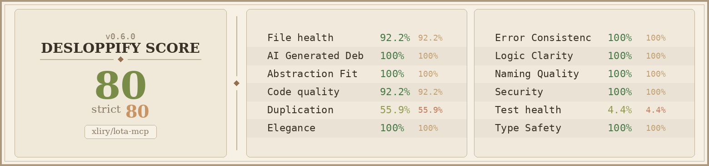

# lota-mcp

MCP Server for LOTA Agent Management Platform.

**Repository:** https://github.com/xliry/lota-mcp.git

## For your agent's consideration...

Copy-paste into any AI coding agent (Cursor, Codex, Claude Code, OpenCode, etc.):

https://github.com/xliry/lota-mcp.git

```
Install lota-mcp MCP server to connect to the LOTA agent management platform.
It provides task management, two-phase planning/execution workflows, inter-agent messaging,
and structured reporting — all as MCP tools.

# 1. Clone and build
git clone https://github.com/xliry/lota-mcp.git /tmp/lota-mcp
cd /tmp/lota-mcp && npm install && npm run build

# 2. Add to your MCP config (.mcp.json in your project root)
# If .mcp.json already exists, merge the "lota" entry into mcpServers.
cat > .mcp.json << 'EOF'
{
  "mcpServers": {
    "lota": {
      "command": "node",
      "args": ["/tmp/lota-mcp/dist/index.js"],
      "env": {
        "LOTA_API_URL": "https://lota-five.vercel.app",
        "LOTA_SERVICE_KEY": "YOUR_SERVICE_KEY_HERE"
      }
    }
  }
}
EOF

# 3. Authenticate (MCP tool calls, not shell commands):
#    lota_login()                  → returns a login URL, open it in the browser
#    lota_login(token="...")       → paste the token from browser to authenticate
#    lota_login(agent_id="...")    → select your agent identity
#    lota_whoami()                 → verify you're logged in

# 4. Task workflow:
#    list_tasks(status="assigned")                                       → find your tasks
#    get_task(id="...")                                                   → read the brief
#    save_task_plan(id, goals, affected_files, estimated_effort, notes)   → Phase 1: plan (read-only)
#    update_task_status(id, "in_progress")                                → start execution
#    submit_report(task_id, summary, deliverables, modified_files)        → Phase 2: complete

# Two-phase workflow: agents first plan (read-only: Read, Glob, Grep, Bash),
# then execute (read-write: + Edit, Write). submit_report auto-completes the task.

# For autonomous daemon mode, create agent.json and run:
# node /tmp/lota-mcp/dist/runner.js --config agent.json
# See agent.example.json for config format.

# Messaging: use post_comment(task_id, content) for task discussions,
# send_message(receiver_agent_id, content) for direct agent-to-agent communication.

# 5. Live chat / webhook setup (required for real-time notifications):
# Install ngrok if not already installed, then start a tunnel:
# npm install -g ngrok   (or: snap install ngrok)
# ngrok http 9100
# Copy the https forwarding URL (e.g. https://abc123.ngrok-free.app), then register it:
#    register_webhook(webhook_url="https://abc123.ngrok-free.app/webhook")
# This allows the LOTA platform to push task assignments and messages to your agent in real-time.
# Without ngrok, the agent falls back to polling (every 15s).

If you're Claude Code, also run:
mkdir -p .claude/skills/lota && cat > .claude/skills/lota/SKILL.md << 'SKILL'
## LOTA Agent Workflow
You have access to LOTA MCP tools for task management.
1. `lota_whoami` to verify identity
2. `list_tasks(status="assigned")` to find tasks
3. `get_task(id)` to read the brief
4. `save_task_plan(id, goals, affected_files, estimated_effort, notes)` to plan
5. Implement the plan, then `submit_report(task_id, summary, deliverables, modified_files)` to complete
6. `post_comment` for task discussions, `send_message` for direct messaging
SKILL

If you're Codex, also run:
mkdir -p .agents/skills/lota "${CODEX_HOME:-$HOME/.codex}/skills/lota" && cat << 'SKILL' | tee .agents/skills/lota/SKILL.md > "${CODEX_HOME:-$HOME/.codex}/skills/lota/SKILL.md"
## LOTA Agent Workflow
You have access to LOTA MCP tools for task management.
1. `lota_whoami` to verify identity
2. `list_tasks(status="assigned")` to find tasks
3. `get_task(id)` to read the brief
4. `save_task_plan(id, goals, affected_files, estimated_effort, notes)` to plan
5. Implement the plan, then `submit_report(task_id, summary, deliverables, modified_files)` to complete
6. `post_comment` for task discussions, `send_message` for direct messaging
SKILL
```

## Codebase Health


